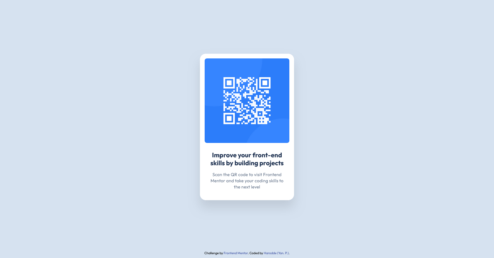

# Frontend Mentor - QR code component solution

This is a solution to the [QR code component challenge on Frontend Mentor](https://www.frontendmentor.io/challenges/qr-code-component-iux_sIO_H). Frontend Mentor challenges help you improve your coding skills by building realistic projects. 

## Table of contents

- [Overview](#overview)
  - [Screenshot](#screenshot)
  - [Links](#links)
- [My process](#my-process)
  - [Built with](#built-with)
  - [What I learned](#what-i-learned)
  - [Continued development](#continued-development)
  - [Useful resources](#useful-resources)
- [Author](#author)
- [Acknowledgments](#acknowledgments)

**Note: Delete this note and update the table of contents based on what sections you keep.**

## Overview

### Screenshot



### Links

- Solution URL: [GitHub](https://github.com/Harodde/frontendmentorProjectGit)
- Live Site URL: [GitHub Pages](https://harodde.github.io/frontendmentorProjectGit/)

## My process

### Built with

- Semantic HTML5
- Custom CSS with variables
- Flexbox for layout
- Mobile-first workflow

### What I learned

- I learned how to use CSS variables to easily manage colors and styling properties.
- I also learned how to reset default styles in CSS to ensure a consistent layout across all browsers.
- Using Figma for visual elements helped me understand proportions and alignment before starting to code.

```
css
:root {
    --White: hsl(0, 0%, 100%);
    --Slate300: hsl(212, 45%, 89%);
    --Slate500: hsl(216, 15%, 48%);
    --Slate900: hsl(218, 44%, 22%);
}

/* Réinitialisation des styles par défaut */
*,
*::before,
*::after {
    margin: 0;
    /* Supprime les marges par défaut */
    padding: 0;
    /* Supprime les espacements internes par défaut */
    box-sizing: border-box;
    /* Intègre le contenu, les bordures et le padding dans la largeur/hauteur */
}
```

### Continued development

In the future, I want to explore using a CSS preprocessor like Sass to organize styles more efficiently.

### Useful resources

- [ChatGPT](https://chat.openai.com) – Was a useful resource for clarifying CSS concepts and solving specific development issues.

## Author

- **Portfolio** : https://votre-portfolio.com *(à venir)*

- Frontend Mentor - [@Harodde](https://www.frontendmentor.io/profile/harodde)
- Linkedin - https://www.linkedin.com/in/ypernet-1a2b3c4d/

## Acknowledgments

Thank you to Frontend Mentor for this challenge, and to everyone who shares resources and helps in the community.
